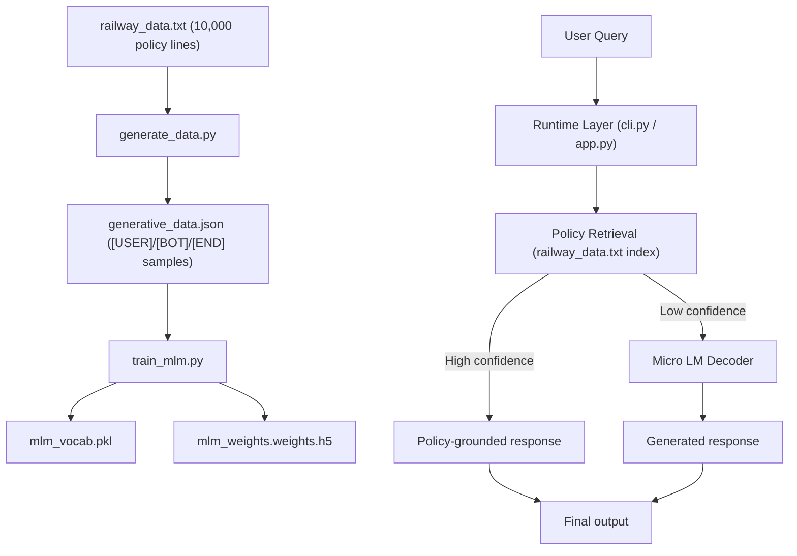
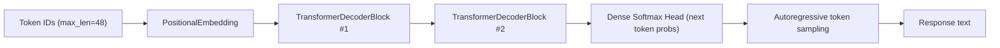

# RailSaathi Architecture and Training Flow

This document explains how RailSaathi is built, how data flows through the system, and how training works end-to-end.

## Architecture Diagram



### Micro LM Decoder (Separated View)



## 1. System Goal

RailSaathi is a **micro language model** focused on Indian Railways policy/rule answering.

Design priorities:

- Train on CPU in minutes.
- Keep model small and practical.
- Prefer grounded policy outputs over fluent but wrong outputs.

To achieve this, the project uses a **hybrid runtime**:

- Retrieval from `railway_data.txt` for high-confidence matches.
- Micro causal LM generation as fallback.

## 2. High-Level Components

- `augment_railway_data.py`
- `generate_data.py`
- `train_mlm.py`
- `mlm_model.py`
- `cli.py`
- `app.py`

## 3. End-to-End Pipeline

### Step A: Build policy corpus (`augment_railway_data.py`)

Input:

- Canonical policy templates defined in `CANONICAL_RULES`.

Process:

- Expands templates via lexical substitutions.
- Wraps with policy-style prefixes/suffixes.
- Normalizes text and de-duplicates.
- Ensures target size (default minimum 10,000 lines).

Output:

- `railway_data.txt` (10,000 unique lines).

### Step B: Build conversational training dataset (`generate_data.py`)

Input:

- `railway_data.txt`.

Process:

- Normalizes each rule.
- Builds topic-driven question variants using `build_topic()` and `build_question_variants()`.
- `build_topic(rule)`: extracts short intent keywords from a rule so questions stay focused.
- `build_question_variants(rule)`: creates multiple natural-language user question forms for the same rule.
- Constructs training rows in conversational format: `[USER] ... [BOT] ... [END]`.
- Adds greeting/fallback examples for conversational stability.
- Shuffles dataset deterministically.

Output:

- `generative_data.json`.

### Step C: Train the micro LM (`train_mlm.py`)

Input:

- `generative_data.json`.

Process:

- Builds `TextVectorization` vocabulary.
- Converts sequences into next-token prediction pairs (`X`, `y`).
- Applies BOT-aware loss masking so training focuses on assistant response tokens.
- Trains causal decoder from `mlm_model.py`.
- Saves best checkpoint based on validation accuracy.

Outputs:

- `mlm_vocab.pkl`
- `mlm_weights.weights.h5`

### Step D: Inference runtime (`cli.py`, `app.py`)

Input:

- User query.

Process:

- Attempt retrieval from `railway_data.txt` index (`retrieve_rule`).
- If confidence threshold passes, return policy line directly.
- Else run autoregressive token generation from micro LM.

Result:

- Stable policy-grounded responses with reduced gibberish risk.

## 4. Model Architecture (`mlm_model.py`)

### `PositionalEmbedding`

Purpose:

- Converts token IDs into dense embeddings.
- Adds learned positional embeddings.
- Applies dropout for regularization.

### `TransformerDecoderBlock`

Purpose:

- Performs masked self-attention (`use_causal_mask=True`).
- Applies feed-forward projection (`Dense -> Dropout -> Dense`).
- Uses residual connections + layer normalization.

### `build_causal_mlm(...)`

Default micro configuration:

- `max_len=48`: maximum tokens the model sees in one sequence (context window length).
- `embed_dim=128`: size of each token embedding vector (how much information each token can carry).
- `dense_dim=256`: hidden size of the feed-forward network inside each transformer block.
- `num_heads=4`: number of attention heads that learn different token relationships in parallel.
- `num_layers=2`: number of stacked decoder blocks (model depth).
- `dropout=0.1`: regularization rate to reduce overfitting during training.

This keeps parameter count small enough for quick CPU training.

## 5. Training Internals (`train_mlm.py`)

### `custom_standardization(input_data)`

- Lowercases text.
- Removes unsupported characters while preserving control tokens like `[bot]`.

### `parse_args()`

Exposes runtime controls:

- `--epochs`: how many full passes over the training dataset.
- `--batch-size`: number of samples processed per optimization step.
- `--max-len`: sequence length used by vectorization/model input.
- `--vocab-size`: maximum number of unique tokens kept in vocabulary.
- `--val-split`: fraction of dataset reserved for validation.

### `build_loss_mask(X, bot_token_id)`

Important behavior:

- Finds `[bot]` token location in each sequence.
- Sets sample weights to 1 only from BOT position onward.
- Zeroes loss weight for pre-answer tokens.

Why this matters:

- The model focuses learning on assistant answer generation.
- Reduces wasted capacity on user prompt reconstruction.

### Dataset construction

- `seqs = vectorizer(samples).numpy()`: converts text samples into integer token IDs.
- `X = seqs[:, :-1]`: input tokens (all tokens except the last one).
- `y = seqs[:, 1:]`: next-token targets (all tokens except the first one).
- `weights = build_loss_mask(...)`: token-level weights so loss focuses on answer-side tokens.

### Callbacks

- `ModelCheckpoint`: stores best weights by `val_accuracy`.
- `ReduceLROnPlateau`: lowers learning rate when validation stalls.
- `EarlyStopping`: restores best epoch if training plateaus.

## 6. Inference and Decoding (`cli.py` / `app.py`)

### Retrieval guardrail (CLI)

Function:

- `retrieve_rule(query, rule_index, token_idf)`

Mechanism:

- `normalize_token(token)`: basic token cleanup/singularization so user wording variants map better.
- `tokenize_for_retrieval(text)`: converts text into normalized keyword tokens after stopword removal.
- `expand_query_tokens(tokens)`: adds synonym tokens (for example, explosives -> hazardous/inflammable).
- `load_assets()`: builds retrieval index and token IDF statistics from `railway_data.txt`.
- IDF-weighted scoring: rare informative terms are weighted higher than generic terms.
- Anchor-token filtering: requires specific intent tokens (for example, `tatkal`) so generic matches are less likely.
- Dynamic thresholding by query token count, then best-match return.

Benefit:

- Reduces hallucinations.
- Improves factual consistency for common policy queries.

### Retrieval guardrail (Streamlit app)

Function:

- `retrieve_rule(query)`

Mechanism:

- Simpler weighted overlap scoring on tokenized policy lines.

Benefit:

- Faster simple retrieval path for UI flow.
- Slightly less robust than CLI retrieval for edge-case phrasing.

### Generation fallback

Function:

- `generate_response(...)`

Decoding controls:

- `temperature=0.3`: low randomness for more stable/less creative outputs.
- `top_k=1`: choose from top-1 token candidate (nearly deterministic decoding).
- repetition penalty: reduces repeated phrase loops in generation.
- blocked control/unknown tokens (`[user]`, `[bot]`, PAD/UNK): prevents unsafe or malformed output tokens.

Benefit:

- Keeps output deterministic and less noisy.
- Additional cleanup in CLI (`format_policy_text`) removes synthetic wrapper prefixes/suffixes before final display.

## 7. Streamlit App Flow (`app.py`)

- Loads model assets and policy index with `@st.cache_resource`.
- Accepts user prompt from `st.chat_input`.
- Generates response via retrieval-first + LM fallback.
- Runs `process_slm_output(...)` for optional structured tags (`[call_route]`, `[call_day]`, `[call_info]`).

Note:

- Structured train lookup path expects `train_info.csv`.

## 8. CLI Flow (`cli.py`)

- Loads vocabulary, model weights, and policy index.
- Builds token statistics (`token_idf`) from the policy corpus.
- Loops on terminal input.
- Returns retrieval-first policy answer or LM fallback answer.
- Normalizes final policy phrasing via prefix/suffix cleanup for cleaner outputs.

Important helper functions in CLI:

- `retrieve_rule(...)`: finds best matching policy line from corpus.
- `clean_rule_for_output(...)`: strips synthetic training wrappers from selected rule text.
- `format_policy_text(...)`: converts raw rule text into user-facing final sentence format.
- `generate_response(...)`: runtime orchestrator (retrieval first, generation fallback).

CLI is the simplest production path for policy-only usage.

## 9. Why This Avoids Gibberish Better

Compared to naive small-LM generation, this setup improves stability because:

- Training data is domain-constrained and normalized.
- Loss is focused on assistant response tokens.
- Decoding is low-temperature and token-filtered.
- Retrieval guardrail handles many direct policy queries deterministically.

## 10. Typical Runtime Characteristics

CPU-only reference run observed in this repository state:

- 4 epochs, batch size 128, max length 48
- ~4.37 minutes total training time
- validation accuracy around 0.96+

Expected practical range on similar hardware:

- 2 epochs: ~2-3 minutes
- 4 epochs: ~4-6 minutes
- 6 epochs: ~6-9 minutes

## 11. Suggested Future Improvements

- Add `evaluate.py` with fixed test-set metrics (exact match, semantic match, topic-wise F1).
- Add confidence scores and abstention path for low-confidence queries.
- Add incremental fine-tuning loop from anonymized real questions.
- Add quantized export for edge deployment.

## 12. Quick Reference Commands

```bash
python3 augment_railway_data.py --target 10000
python3 generate_data.py
python3 train_mlm.py --epochs 4 --batch-size 128 --vocab-size 6000 --max-len 48
python3 cli.py
streamlit run app.py
```
